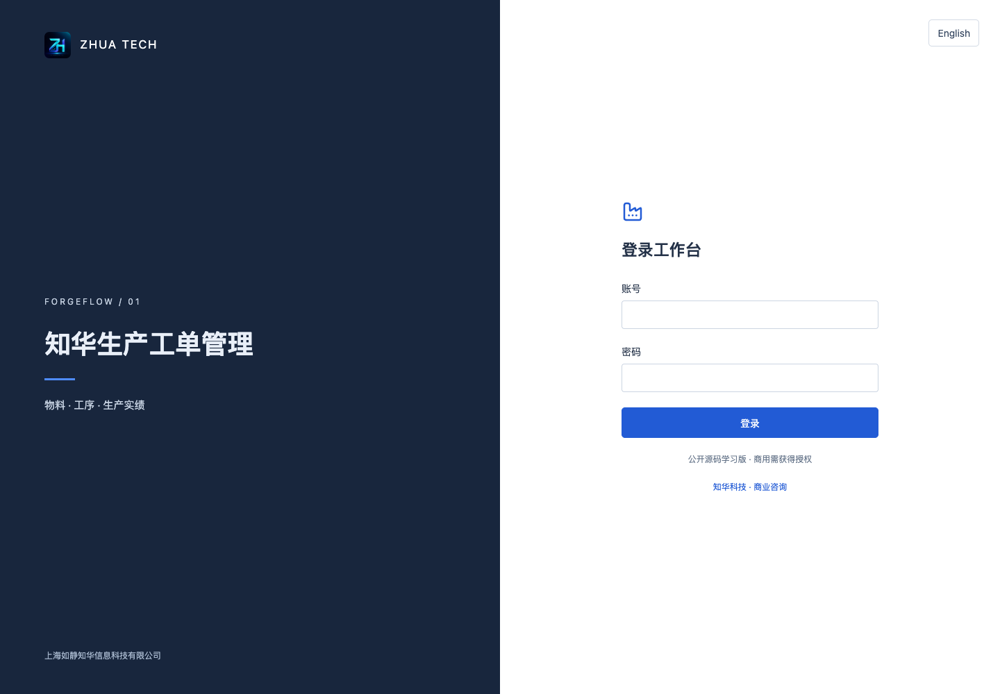
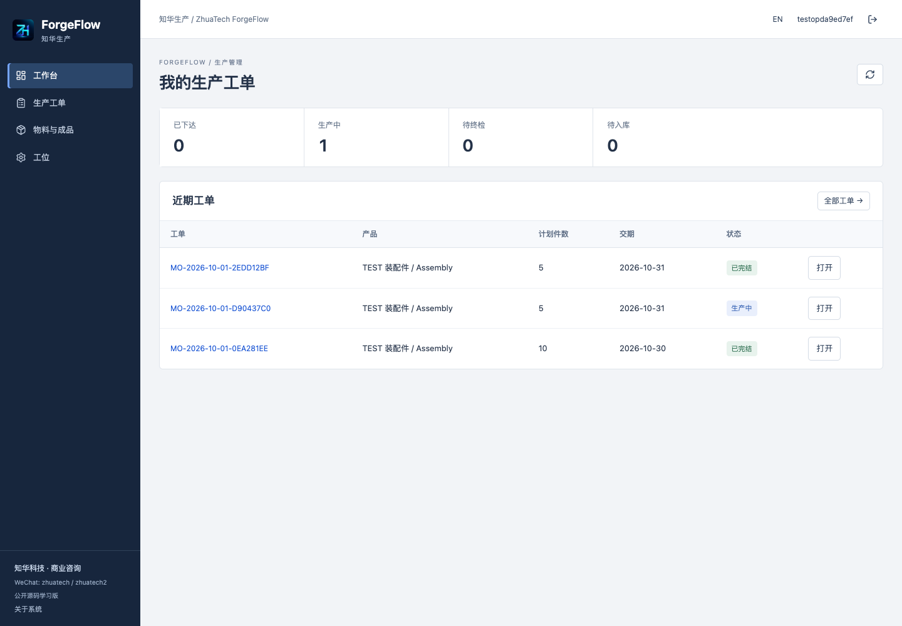
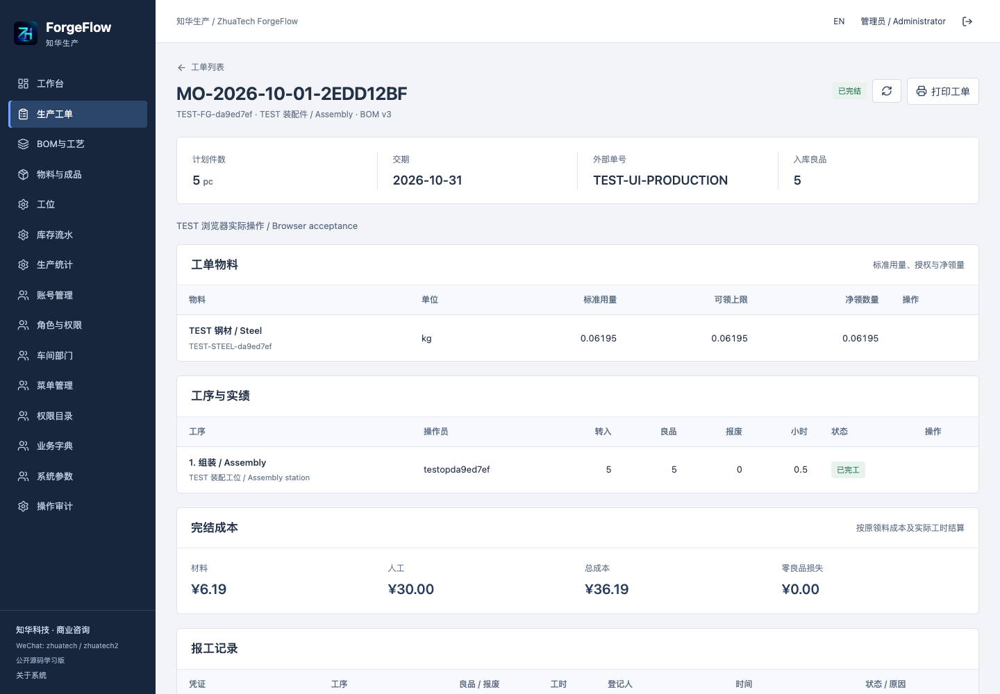
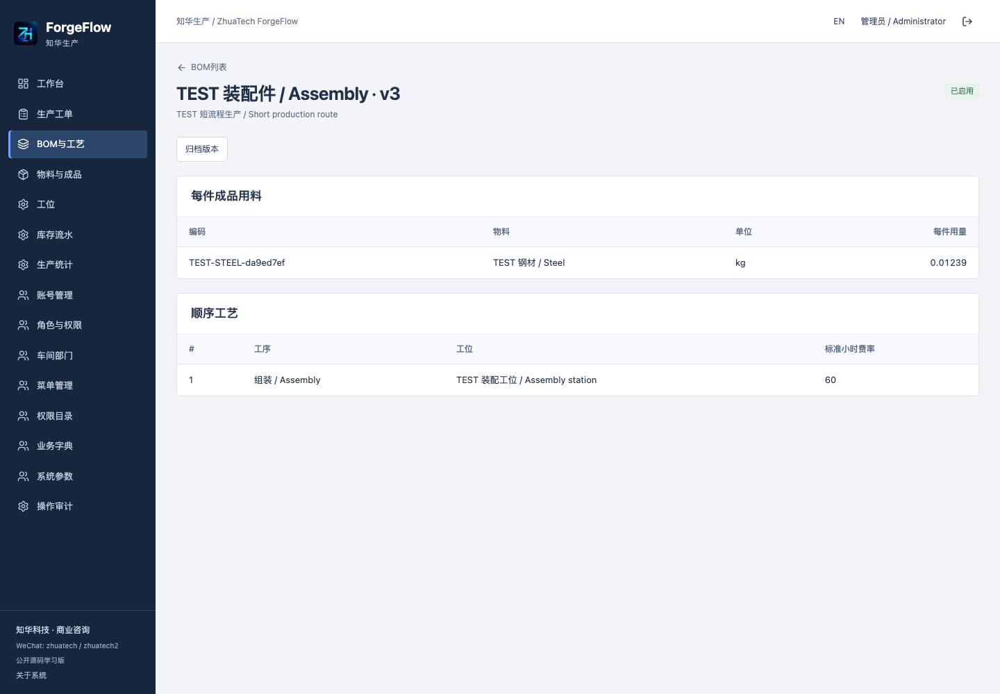
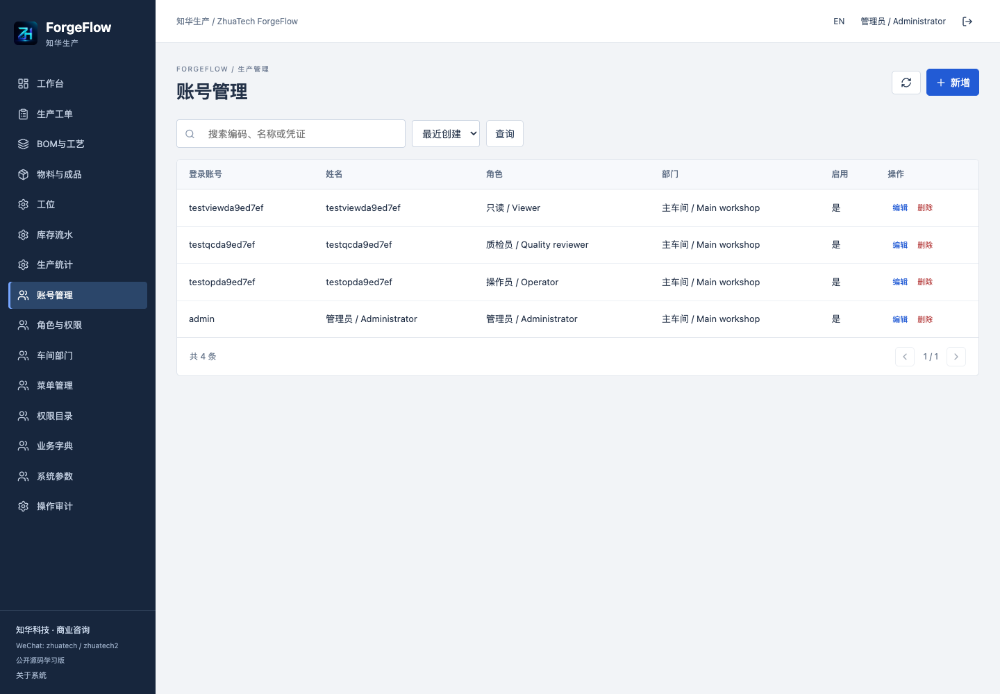
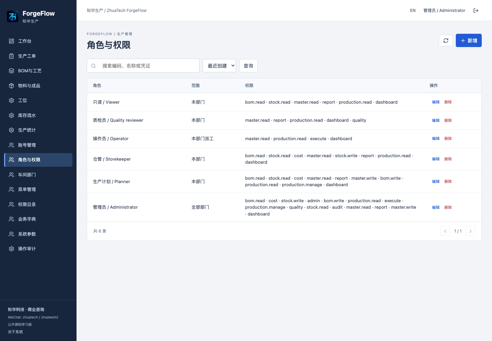
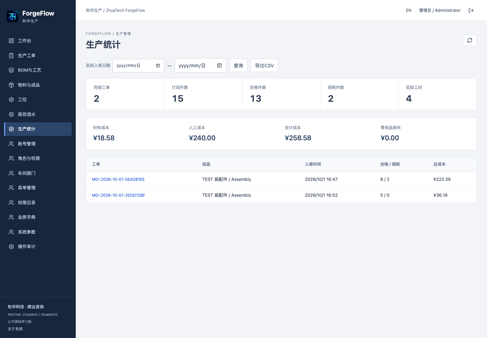
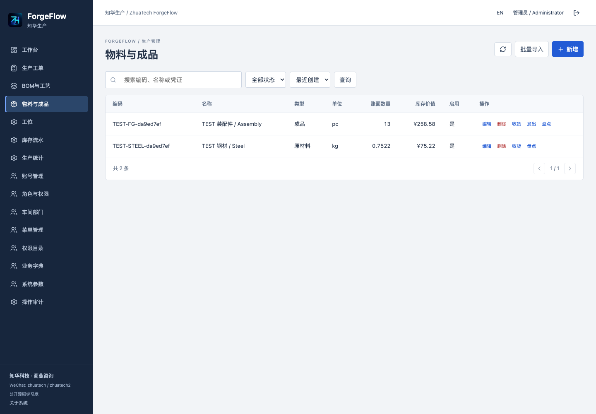
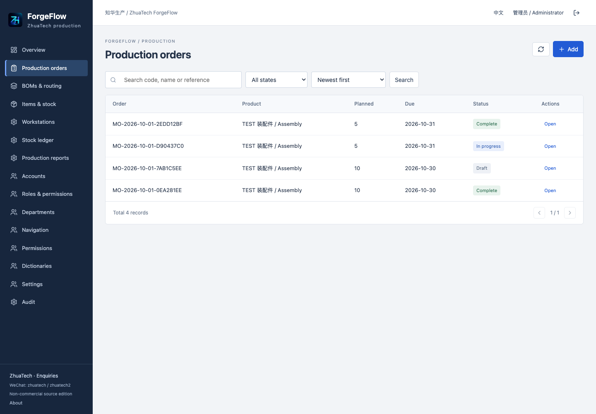
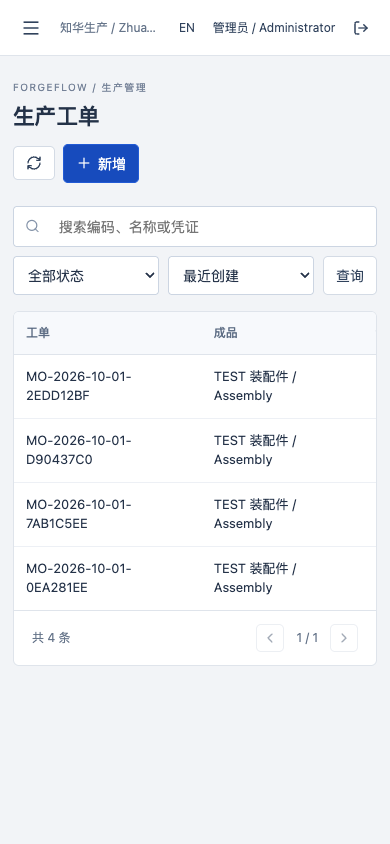

<div align="center">

<h1>知华生产工单管理 · ForgeFlow</h1>
<p>单层 BOM → 下达派工 → 领退料 → 顺序报工 → 独立终检 → 成品入库与成本追溯</p>
<p><a href="https://www.zhuatech.cn/">知华科技官网</a> · <a href="docs/ENGLISH.md">English</a> · <a href="docs/OPERATIONS.md">操作手册</a> · <a href="LICENSE">非商业源码许可</a></p>
</div>

由知华科技（上海如静知华信息科技有限公司）提供。**公开源码学习版／非商业源码版**，不是无限制商业开源许可。商用、客户交付或经营用途须先取得书面授权。

## 面向生产执行的工作台

适用于按件生产的装配、加工小车间及为其实施系统的软件团队。生产计划、仓库、操作员和质检岗位共同记录一张生产工单，替代分散的用料表、派工表和报工记录。面向单层 BOM、顺序工艺、单币种成本及人工登记场景。

启用 BOM 冻结版本，下达时固化材料和工艺快照；物料最多六位小数，成品产量按整数件记录。后道工序只能接收前道实际良品，未交代完转入数量不能完工。终检与报工人员分离；通过后按原材料净成本和实际工时入库。全部损失时结单登记成本损失，不生成虚假入库。

本系统不替代完整 ERP 或自动化 MES：不含采购销售单、财务总账、付款、客户合同、多层 BOM、MRP、库存预约、批次序列号、跨仓调拨、自动排程、设备采集及连续流程制造。成品发出是仓库登记，不能当作销售收入或物流签收。未接入第三方服务，无模型、支付或外部通知依赖。

## 可操作模块

| 模块 | 已实现行为 |
|---|---|
| 物料与成品 | 编码、类型、单位、规格、部门、启停、库存阈值；原子 JSON 导入、搜索分页；收货、成品发出与带账面快照盘点 |
| 工位 | 名称、部门、四位标准小时费率、启停；BOM 保存时固化费率 |
| BOM与工艺 | 每件材料六位数量、顺序工序、版本草稿、启用冻结、归档、未引用草稿删除 |
| 生产工单 | 草稿计划、交期及外部引用、下达快照、逐工序派工、开工、取消与事件履历 |
| 领退料 | 可领上限、库存短缺拦截、原因必填的授权调整、引用原领料退回原成本 |
| 报工 | 当前派工人员登记良品、报废、工时；工序完工守恒；受控冲销保留原记录并保护后道实绩 |
| 终检与返工 | 非本单报工人员登记检验，接受数量不超末道良品；不通过重开末道工序并保留历次检验 |
| 入库与统计 | 终检后一次入库、零良品损失、移动平均库存价值、按实际入库日期统计和 CSV 导出、工单打印 |
| 系统管理 | 账号增改停用、密码重置与自助修改、角色权限、部门范围、派工范围、菜单、业务字典、参数、操作审计 |
| 界面 | 中文／English、管理工作台与操作员本人派工首页、窄屏导航与表格滚动 |

完整流程见[操作手册](docs/OPERATIONS.md)。表单中的凭证是人员录入的内部或外部单号，不代表第三方系统已自动核验。

## 运行页面

以下均为当前系统运行页面。演示数据为虚构学习记录；账号密码不公开。

| 登录 | 操作员首页 |
|---|---|
|  |  |

| 工单材料与工艺 | BOM版本与用料 |
|---|---|
|  |  |

| 账号管理 | 角色与权限 |
|---|---|
|  |  |

| 生产统计 | 库存管理 |
|---|---|
|  |  |

| English | 手机页面 |
|---|---|
|  |  |

## 工程与技术

浏览器 → Vue 3 同源页面 → Nginx `/api` → Spring Boot → MySQL。Java 21、Spring Boot 4.0.7、Vue 3.5、Vite 8、Node.js 24.19、MySQL 8.4（MySQL 8 系列）、Flyway 版本迁移、Docker Compose v2。MariaDB JDBC 驱动连接 MySQL；不是 MariaDB 服务端。依赖许可见[第三方声明](docs/THIRD_PARTY.md)。

```text
backend/    Java 服务、领域规则、HTTP 接口、Flyway SQL、单元及集成测试
frontend/   Vue 页面、中文英文、界面样式、Nginx 和前端测试
scripts/    独立环境初始化、发布检查与真实 HTTP 流程检查
docs/      操作、架构、接口部署与测试说明、真实截图及品牌图片
compose.yaml / .env.example / LICENSE
```

[架构与接口](docs/ARCHITECTURE.md)说明数据关系、状态流转、锁与成本口径。数据库有主外键、唯一约束和数量检查；库存不能从档案表单覆盖。领域写入与事件／审计／幂等记录同事务提交。当前采用基础部门行锁串行化业务写入，适合小车间；高吞吐并发须评估锁策略和数据库索引。列表超过 10,000 条明确拒绝，分页 1–100 条，批量导入最多 500 条；不宣称已具备大规模生产负载能力。

## Docker Compose 启动

需要 Docker Engine／Desktop 与 Compose v2；使用容器启动时不需要本机安装 Java、Node 或数据库。首次构建需要下载镜像和依赖。

```bash
python3 scripts/init-env.py
# 可编辑 .env 中的 WEB_PORT、BIND_ADDRESS 等配置
docker compose --env-file .env up --build -d
docker compose --env-file .env ps
```

访问 `http://localhost:8099`。初始用户名为 `admin`，**没有通用默认密码**；管理员密码由初始化脚本独立生成并保存到本机 `.env`，按该值登录。不要上传或分享 `.env`。第一次空库初始化六个岗位角色、主车间、菜单、权限、偏差原因字典和参数。默认不含物料或业务数据。首次空库设 `SEED_DEMO=true` 可增加虚构成品、材料、工位和一个 BOM 草稿，库存均为零，不含员工、工单或伪造产量。重启不会覆盖已有账号或业务数据；改变初始化密码不会重置已有账号。

端口冲突时在 `.env` 设置 `WEB_PORT=8109`，或一次性运行 `WEB_PORT=8109 docker compose --env-file .env up -d`。默认只绑定 `127.0.0.1`，数据库和后端不映射宿主端口。

| 环境变量 | 含义 |
|---|---|
| `MYSQL_ROOT_PASSWORD` | MySQL root 独立强密码，仅数据库管理使用 |
| `DATABASE_PASSWORD` | 应用数据库账号独立密码 |
| `ADMIN_USERNAME` / `ADMIN_PASSWORD` | 第一次空库创建的管理员及强密码（12–72位，含大小写和数字） |
| `SEED_DEMO` | 默认 false，首次空库可选学习档案 |
| `WEB_PORT` / `BIND_ADDRESS` | 默认 8099 / 127.0.0.1 |
| `COOKIE_SECURE` | 默认 false 便于本机 HTTP；对外 HTTPS 部署设 true |
| `DATABASE_URL` / `DATABASE_USER` | 可选外部 MySQL JDBC 地址／账号；详细 TLS 要求见部署说明 |

## 本地开发、升级与维护

本机开发安装 Java 21、Maven 3.9、Node.js 24.19+、npm。启动独立 MySQL 8，创建 UTF-8 数据库及非 root 应用账号；设置 `DATABASE_URL`（`jdbc:mariadb://...`）、`DATABASE_USER`、`DATABASE_PASSWORD`、`ADMIN_PASSWORD`，在 `backend` 执行 `mvn spring-boot:run`。另一个终端在 `frontend` 执行 `npm ci && npm run dev`，Vite 本机端口 5173 代理后端 8080。不要用客户数据库作开发或测试。

Flyway 在启动时自动执行 `backend/src/main/resources/db/migration` 中尚未应用的迁移；当前版本 V1。先备份并在独立库验证，再升级镜像。**不修改已应用的 SQL、不清空迁移历史、不用 Hibernate 自动更新表结构**。备份、恢复、HTTPS、健康检查及日志命令见[部署维护](docs/DEPLOYMENT.md)。只停服务用 `docker compose down`；`down -v` 会删除该 Compose 的数据卷，仅用于确认可丢弃的测试环境。

## 验收和故障排查

```bash
cd backend
mvn spotless:check test package
cd ../frontend
npm ci
npm run format:check
npm run lint
npm test
npm run build
cd ..
python3 scripts/release-check.py
# 启动独立测试实例后，显式指定测试地址；仅在可丢弃测试库执行
python3 scripts/smoke.py --base http://localhost:18109 --env /path/to/private-test.env --allow-test-writes
```

[测试与限制](docs/VALIDATION.md)记录实际检查及范围。H2 集成测试不替代 MySQL 验收。烟测会创建带 TEST 标记的虚构档案、岗位账号及工单，不用于现有业务库。

- 启动失败：查看 `docker compose logs --tail=150 backend mysql`，检查空密码、数据库健康和迁移校验；修复原因后重试，不能跳过校验。
- 无法登录：区分第一次初始化密码与后来改过的密码；查看账号启用状态。旧会话在账号禁用或密码变化后立即失效。
- 无法开工／完工：检查派工、每种材料净领数量、前道完成状态，以及良品加报废是否等于转入量。
- 终检被拒绝：本单任何报工人员（包括已冲销记录的人员）不得做终检；请使用独立质检账号。
- 无法取消：只允许草稿或尚未开工的已下达工单，已领材料须全部退回。开工后没有“强行清零”或撤销生产的快捷入口。
- 看不到工单／成本：查看部门、派工范围及单独成本权限，不能靠更改前端菜单绕过。

## 安全与使用边界

BCrypt 密码、服务端会话、CSRF、HttpOnly／SameSite Cookie、登录失败限制、实时角色校验、部门与派工隔离、单独成本字段权限、CSV 公式前缀防护。不要将客户端外部引用当作认证证据。默认单实例部署；多实例会话与共享限流未实现。无文件上传、接口密钥、线上支付或自动设备控制。内网使用也需账号治理、独立备份和人工复核。

公开源码不能保证符合特定工厂的生产、质检、财务或行业监管要求；正式使用前应结合实际工艺做试运行、数据核对、备份恢复及安全评估。未进行客户现场验收或大型压力测试。

## 贡献与反馈

在 [GitHub Issues](https://github.com/zhuatech-han/zhuatech-forgeflow/issues) 提交可复现步骤、版本和去敏后的错误信息。贡献应保持领域规则、品牌署名与第三方声明，并提供对应验收；不要提交真实客户、员工资料、密码或日志敏感载荷。贡献须符合本仓库非商业许可；商用或重新授权须联系知华科技。安全漏洞请通过下方官网／微信私下反馈，不在公开 Issue 披露攻击细节、凭证或生产数据。

## 联系知华科技

本项目由知华科技（上海如静知华信息科技有限公司）提供公开源码学习版本，主要用于个人学习、技术研究与非商业交流。未经书面授权不得商用。企业信息化建设、中小企业数字化转型、中小企业 AI 转型、私有化部署、软件外包、软件项目外包、软件实施、FDE 外包、OPC 技术支持及深度定制开发，请访问知华科技官网 [https://www.zhuatech.cn/](https://www.zhuatech.cn/)，或添加微信 zhuatech、zhuatech2 咨询。

商业源码授权、定制、数据迁移、部署实施、ERP／设备及其他系统集成请咨询知华科技。品牌署名和联系方式不构成商用许可，授权范围以书面协议为准。

<p align="center">


</p>
<p align="center">微信：zhuatech · zhuatech2　｜　官网：<a href="https://www.zhuatech.cn/">https://www.zhuatech.cn/</a></p>
